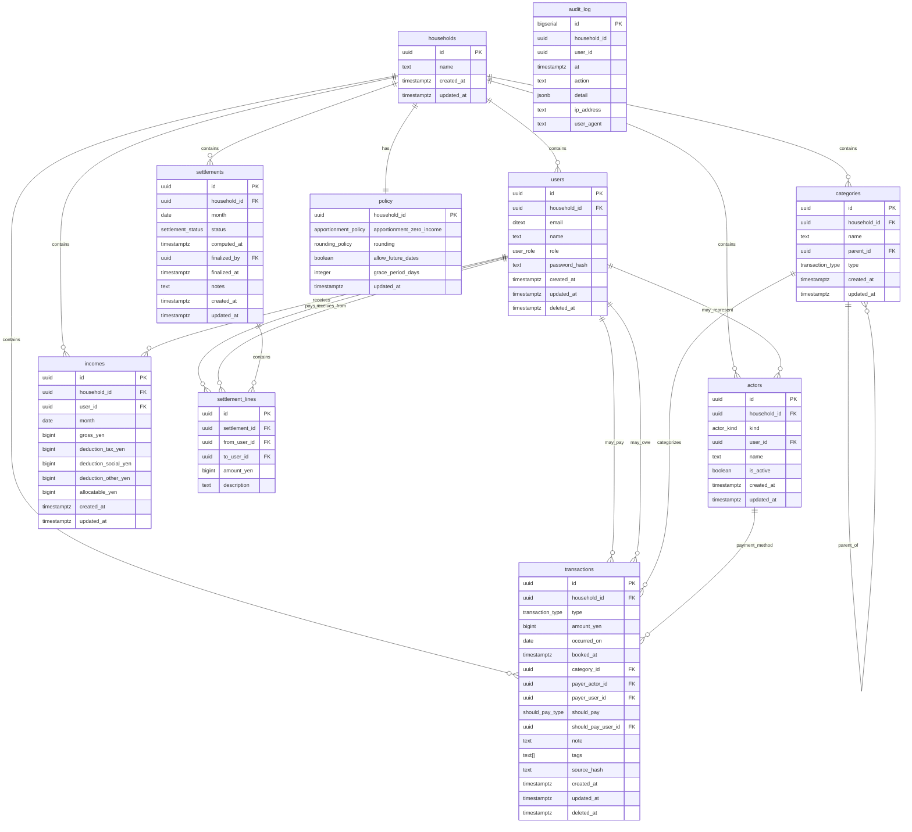

# NestEgg Database Schema

**Date:** 2025-08-23  
**Version:** 1.0  
**Database:** PostgreSQL 15+  
**ORM:** Prisma

---

## Table of Contents

1. [Schema Overview](#schema-overview)
2. [Core Tables](#core-tables)
3. [Relationships](#relationships)
4. [Indexes](#indexes)
5. [Constraints](#constraints)
6. [Row-Level Security](#row-level-security)
7. [Triggers & Functions](#triggers--functions)
8. [Migrations](#migrations)
9. [Prisma Schema](#prisma-schema)
10. [Sample Data](#sample-data)

---

## Schema Overview

### Design Principles

1. **Multi-tenant by Household:** All data isolated by `household_id` with RLS
2. **Integer Yen Only:** All monetary amounts stored as `BIGINT` (integer yen)
3. **Audit Trail:** Complete change history with soft deletion
4. **Flexible Payment Actors:** Support both user and non-user payment methods
5. **Immutable Financials:** Historical data preserved for auditing

### Entity Relationship Diagram



---

## Core Tables

### 1. households

**Purpose:** Top-level tenant isolation  
**Partitioning:** None (expected low volume)

```sql
CREATE TABLE households (
    id UUID PRIMARY KEY DEFAULT gen_random_uuid(),
    name TEXT NOT NULL CHECK (length(name) BETWEEN 1 AND 100),
    created_at TIMESTAMPTZ NOT NULL DEFAULT now(),
    updated_at TIMESTAMPTZ NOT NULL DEFAULT now()
);

CREATE TRIGGER households_updated_at 
    BEFORE UPDATE ON households
    FOR EACH ROW 
    EXECUTE FUNCTION update_updated_at();
```

### 2. users

**Purpose:** Household members with authentication  
**Key Features:** Soft deletion, role-based permissions, email uniqueness per household

```sql
CREATE TYPE user_role AS ENUM ('admin', 'member');

CREATE TABLE users (
    id UUID PRIMARY KEY DEFAULT gen_random_uuid(),
    household_id UUID NOT NULL REFERENCES households(id) ON DELETE CASCADE,
    email CITEXT NOT NULL,
    name TEXT NOT NULL CHECK (length(name) BETWEEN 1 AND 100),
    role user_role NOT NULL DEFAULT 'member',
    password_hash TEXT NOT NULL,
    created_at TIMESTAMPTZ NOT NULL DEFAULT now(),
    updated_at TIMESTAMPTZ NOT NULL DEFAULT now(),
    deleted_at TIMESTAMPTZ NULL,
    
    -- Unique email within household (excluding soft-deleted)
    CONSTRAINT unique_household_email 
        UNIQUE (household_id, email) DEFERRABLE INITIALLY DEFERRED,
    
    -- Ensure at least one admin per household
    CONSTRAINT check_valid_role CHECK (role IN ('admin', 'member'))
);

-- Partial unique index to handle soft deletion
CREATE UNIQUE INDEX users_household_email_active 
    ON users (household_id, email) 
    WHERE deleted_at IS NULL;

CREATE INDEX users_household_id_idx ON users (household_id);
CREATE INDEX users_email_idx ON users (email);

CREATE TRIGGER users_updated_at 
    BEFORE UPDATE ON users
    FOR EACH ROW 
    EXECUTE FUNCTION update_updated_at();
```

### 3. actors

**Purpose:** Payment methods (users, cards, cash, etc.)  
**Key Features:** Flexible payment actor model supporting both users and instruments

```sql
CREATE TYPE actor_kind AS ENUM ('USER', 'INSTRUMENT');

CREATE TABLE actors (
    id UUID PRIMARY KEY DEFAULT gen_random_uuid(),
    household_id UUID NOT NULL REFERENCES households(id) ON DELETE CASCADE,
    kind actor_kind NOT NULL,
    user_id UUID NULL REFERENCES users(id) ON DELETE CASCADE,
    name TEXT NOT NULL CHECK (length(name) BETWEEN 1 AND 100),
    is_active BOOLEAN NOT NULL DEFAULT true,
    created_at TIMESTAMPTZ NOT NULL DEFAULT now(),
    updated_at TIMESTAMPTZ NOT NULL DEFAULT now(),
    
    -- user_id required when kind='USER', null when kind='INSTRUMENT'
    CONSTRAINT actor_user_consistency CHECK (
        (kind = 'USER' AND user_id IS NOT NULL) OR 
        (kind = 'INSTRUMENT' AND user_id IS NULL)
    ),
    
    -- Unique actor per household (by kind + user_id + name)
    CONSTRAINT unique_household_actor 
        UNIQUE (household_id, kind, COALESCE(user_id, '00000000-0000-0000-0000-000000000000'::uuid), name)
);

CREATE INDEX actors_household_id_idx ON actors (household_id);
CREATE INDEX actors_user_id_idx ON actors (user_id) WHERE user_id IS NOT NULL;
CREATE INDEX actors_kind_active_idx ON actors (household_id, kind, is_active);

CREATE TRIGGER actors_updated_at 
    BEFORE UPDATE ON actors
    FOR EACH ROW 
    EXECUTE FUNCTION update_updated_at();
```

### 4. categories

**Purpose:** Hierarchical expense/income categorization  
**Key Features:** Self-referencing hierarchy, type-specific trees

```sql
CREATE TYPE transaction_type AS ENUM ('EXPENSE', 'INCOME');

CREATE TABLE categories (
    id UUID PRIMARY KEY DEFAULT gen_random_uuid(),
    household_id UUID NOT NULL REFERENCES households(id) ON DELETE CASCADE,
    name TEXT NOT NULL CHECK (length(name) BETWEEN 1 AND 100),
    parent_id UUID NULL REFERENCES categories(id) ON DELETE CASCADE,
    type transaction_type NOT NULL,
    created_at TIMESTAMPTZ NOT NULL DEFAULT now(),
    updated_at TIMESTAMPTZ NOT NULL DEFAULT now(),
    
    -- Unique name per household per type at same level
    CONSTRAINT unique_household_category 
        UNIQUE (household_id, name, type, COALESCE(parent_id, '00000000-0000-0000-0000-000000000000'::uuid)),
    
    -- Parent must be same type
    CONSTRAINT category_hierarchy_type_consistency 
        CHECK (parent_id IS NULL OR 
               (SELECT type FROM categories p WHERE p.id = parent_id) = type)
);

CREATE INDEX categories_household_id_idx ON categories (household_id);
CREATE INDEX categories_parent_id_idx ON categories (parent_id) WHERE parent_id IS NOT NULL;
CREATE INDEX categories_type_idx ON categories (household_id, type);

CREATE TRIGGER categories_updated_at 
    BEFORE UPDATE ON categories
    FOR EACH ROW 
    EXECUTE FUNCTION update_updated_at();

-- Prevent circular references in category hierarchy
CREATE OR REPLACE FUNCTION check_category_hierarchy()
RETURNS TRIGGER AS $
BEGIN
    IF NEW.parent_id IS NOT NULL THEN
        -- Check for circular reference using recursive CTE.
        -- A hard limit of 10 levels is imposed to prevent infinite recursion
        -- in case of unexpected data issues, which also sets a practical depth limit.
        WITH RECURSIVE category_path AS (
            SELECT id, parent_id, 1 as level
            FROM categories 
            WHERE id = NEW.parent_id
            
            UNION ALL
            
            SELECT c.id, c.parent_id, cp.level + 1
            FROM categories c
            JOIN category_path cp ON c.id = cp.parent_id
            WHERE cp.level < 10  -- Prevent infinite recursion
        )
        SELECT 1 FROM category_path WHERE id = NEW.id LIMIT 1
        INTO STRICT;
        
        IF FOUND THEN
            RAISE EXCEPTION 'Circular reference detected in category hierarchy';
        END IF;
    END IF;
    
    RETURN NEW;
END;
$$ LANGUAGE plpgsql;

CREATE TRIGGER category_hierarchy_check
    BEFORE INSERT OR UPDATE ON categories
    FOR EACH ROW
    EXECUTE FUNCTION check_category_hierarchy();
```

### 5. transactions

**Purpose:** Core financial records  
**Key Features:** Flexible payer model, soft deletion, full audit trail

```sql
CREATE TYPE should_pay_type AS ENUM ('HOUSEHOLD', 'USER');

CREATE TABLE transactions (
    id UUID PRIMARY KEY DEFAULT gen_random_uuid(),
    household_id UUID NOT NULL REFERENCES households(id) ON DELETE CASCADE,
    type transaction_type NOT NULL,
    amount_yen BIGINT NOT NULL CHECK (amount_yen > 0),
    occurred_on DATE NOT NULL,
    booked_at TIMESTAMPTZ NOT NULL DEFAULT now(),
    category_id UUID NOT NULL REFERENCES categories(id) ON DELETE RESTRICT,
    payer_actor_id UUID NOT NULL REFERENCES actors(id) ON DELETE RESTRICT,
    payer_user_id UUID NULL REFERENCES users(id) ON DELETE SET NULL,
    should_pay should_pay_type NOT NULL,
    should_pay_user_id UUID NULL REFERENCES users(id) ON DELETE RESTRICT,
    note TEXT NULL CHECK (length(note) <= 500),
    tags TEXT[] NOT NULL DEFAULT '{}',
    source_hash TEXT NULL,  -- For import deduplication
    created_at TIMESTAMPTZ NOT NULL DEFAULT now(),
    updated_at TIMESTAMPTZ NOT NULL DEFAULT now(),
    deleted_at TIMESTAMPTZ NULL,
    
    -- Business rule constraints
    CONSTRAINT transaction_should_pay_user_consistency CHECK (
        (should_pay = 'HOUSEHOLD' AND should_pay_user_id IS NULL) OR
        (should_pay = 'USER' AND should_pay_user_id IS NOT NULL)
    ),
    
    -- Transaction type must match category type
    CONSTRAINT transaction_category_type_consistency CHECK (
        (SELECT c.type FROM categories c WHERE c.id = category_id) = type
    ),
    
    -- Payer actor must belong to same household
    CONSTRAINT transaction_actor_household_consistency CHECK (
        (SELECT a.household_id FROM actors a WHERE a.id = payer_actor_id) = household_id
    ),
    
    -- Should pay user must belong to same household
    CONSTRAINT transaction_should_pay_user_household_consistency CHECK (
        should_pay_user_id IS NULL OR
        (SELECT u.household_id FROM users u WHERE u.id = should_pay_user_id) = household_id
    ),
    
    -- Tags array validation
    CONSTRAINT transaction_tags_valid CHECK (
        array_length(tags, 1) IS NULL OR array_length(tags, 1) <= 20
    ),
    
    -- Prevent future dates (configurable via policy)
    CONSTRAINT transaction_date_not_future CHECK (
        occurred_on <= current_date + INTERVAL '1 day'
    )
);

-- Primary indexes for common access patterns
CREATE INDEX transactions_household_occurred_idx 
    ON transactions (household_id, occurred_on DESC) 
    WHERE deleted_at IS NULL;

CREATE INDEX transactions_category_idx 
    ON transactions (category_id) 
    WHERE deleted_at IS NULL;

CREATE INDEX transactions_payer_actor_idx 
    ON transactions (payer_actor_id) 
    WHERE deleted_at IS NULL;

CREATE INDEX transactions_should_pay_user_idx 
    ON transactions (should_pay_user_id) 
    WHERE deleted_at IS NULL AND should_pay_user_id IS NOT NULL;

CREATE INDEX transactions_type_should_pay_idx 
    ON transactions (household_id, type, should_pay) 
    WHERE deleted_at IS NULL;

-- Full-text search on note
CREATE INDEX transactions_note_fulltext_idx 
    ON transactions USING gin(to_tsvector('english', note)) 
    WHERE deleted_at IS NULL AND note IS NOT NULL;

-- Tag search
CREATE INDEX transactions_tags_gin_idx 
    ON transactions USING gin(tags) 
    WHERE deleted_at IS NULL;

-- Import deduplication
CREATE UNIQUE INDEX transactions_source_hash_unique_idx 
    ON transactions (household_id, source_hash) 
    WHERE source_hash IS NOT NULL AND deleted_at IS NULL;

-- Settlement queries - monthly aggregation
CREATE INDEX transactions_settlement_query_idx 
    ON transactions (household_id, date_trunc('month', occurred_on), should_pay) 
    WHERE deleted_at IS NULL;

CREATE TRIGGER transactions_updated_at 
    BEFORE UPDATE ON transactions
    FOR EACH ROW 
    EXECUTE FUNCTION update_updated_at();
```

### 6. incomes

**Purpose:** Monthly income tracking for settlement calculations  
**Key Features:** Computed allocatable amount, unique per user per month

```sql
CREATE TABLE incomes (
    id UUID PRIMARY KEY DEFAULT gen_random_uuid(),
    household_id UUID NOT NULL REFERENCES households(id) ON DELETE CASCADE,
    user_id UUID NOT NULL REFERENCES users(id) ON DELETE CASCADE,
    month DATE NOT NULL CHECK (date_trunc('month', month) = month),
    gross_yen BIGINT NOT NULL CHECK (gross_yen >= 0),
    deduction_tax_yen BIGINT NOT NULL DEFAULT 0 CHECK (deduction_tax_yen >= 0),
    deduction_social_yen BIGINT NOT NULL DEFAULT 0 CHECK (deduction_social_yen >= 0),
    deduction_other_yen BIGINT NOT NULL DEFAULT 0 CHECK (deduction_other_yen >= 0),
    
    -- Computed column for allocatable income
    allocatable_yen BIGINT GENERATED ALWAYS AS (
        gross_yen - deduction_tax_yen - deduction_social_yen - deduction_other_yen
    ) STORED,
    
    created_at TIMESTAMPTZ NOT NULL DEFAULT now(),
    updated_at TIMESTAMPTZ NOT NULL DEFAULT now(),
    
    -- One income record per user per month
    CONSTRAINT unique_user_month UNIQUE (household_id, user_id, month),
    
    -- Deductions cannot exceed gross
    CONSTRAINT deductions_not_exceed_gross CHECK (
        deduction_tax_yen + deduction_social_yen + deduction_other_yen <= gross_yen
    ),
    
    -- User must belong to same household
    CONSTRAINT income_user_household_consistency CHECK (
        (SELECT u.household_id FROM users u WHERE u.id = user_id) = household_id
    )
);

CREATE INDEX incomes_household_id_idx ON incomes (household_id);
CREATE INDEX incomes_user_month_idx ON incomes (user_id, month);
CREATE INDEX incomes_month_idx ON incomes (household_id, month);

CREATE TRIGGER incomes_updated_at 
    BEFORE UPDATE ON incomes
    FOR EACH ROW 
    EXECUTE FUNCTION update_updated_at();
```

### 7. settlements

**Purpose:** Month-end settlement calculations  
**Key Features:** Draft/finalized workflow, idempotent computation

```sql
CREATE TYPE settlement_status AS ENUM ('DRAFT', 'FINALIZED');

CREATE TABLE settlements (
    id UUID PRIMARY KEY DEFAULT gen_random_uuid(),
    household_id UUID NOT NULL REFERENCES households(id) ON DELETE CASCADE,
    month DATE NOT NULL CHECK (date_trunc('month', month) = month),
    status settlement_status NOT NULL DEFAULT 'DRAFT',
    computed_at TIMESTAMPTZ NOT NULL DEFAULT now(),
    finalized_by UUID NULL REFERENCES users(id) ON DELETE SET NULL,
    finalized_at TIMESTAMPTZ NULL,
    notes TEXT NULL CHECK (length(notes) <= 1000),
    created_at TIMESTAMPTZ NOT NULL DEFAULT now(),
    updated_at TIMESTAMPTZ NOT NULL DEFAULT now(),
    
    -- One settlement per household per month
    CONSTRAINT unique_household_month UNIQUE (household_id, month),
    
    -- Finalization consistency
    CONSTRAINT settlement_finalization_consistency CHECK (
        (status = 'DRAFT' AND finalized_by IS NULL AND finalized_at IS NULL) OR
        (status = 'FINALIZED' AND finalized_by IS NOT NULL AND finalized_at IS NOT NULL)
    ),
    
    -- Finalizer must belong to same household
    CONSTRAINT settlement_finalizer_household_consistency CHECK (
        finalized_by IS NULL OR
        (SELECT u.household_id FROM users u WHERE u.id = finalized_by) = household_id
    )
);

CREATE INDEX settlements_household_month_idx ON settlements (household_id, month DESC);
CREATE INDEX settlements_status_idx ON settlements (household_id, status);

CREATE TRIGGER settlements_updated_at 
    BEFORE UPDATE ON settlements
    FOR EACH ROW 
    EXECUTE FUNCTION update_updated_at();
```

### 8. settlement_lines

**Purpose:** Individual transfers within settlements  
**Key Features:** User-to-user transfers, audit trail

```sql
CREATE TABLE settlement_lines (
    id UUID PRIMARY KEY DEFAULT gen_random_uuid(),
    settlement_id UUID NOT NULL REFERENCES settlements(id) ON DELETE CASCADE,
    from_user_id UUID NOT NULL REFERENCES users(id) ON DELETE RESTRICT,
    to_user_id UUID NOT NULL REFERENCES users(id) ON DELETE RESTRICT,
    amount_yen BIGINT NOT NULL CHECK (amount_yen > 0),
    description TEXT NOT NULL DEFAULT '',
    
    -- Users cannot transfer to themselves
    CONSTRAINT no_self_transfer CHECK (from_user_id != to_user_id),
    
    -- Both users must belong to settlement's household
    CONSTRAINT settlement_line_user_consistency CHECK (
        (SELECT s.household_id FROM settlements s WHERE s.id = settlement_id) = 
        (SELECT u.household_id FROM users u WHERE u.id = from_user_id)
        AND
        (SELECT s.household_id FROM settlements s WHERE s.id = settlement_id) = 
        (SELECT u.household_id FROM users u WHERE u.id = to_user_id)
    )
);

CREATE INDEX settlement_lines_settlement_idx ON settlement_lines (settlement_id);
CREATE INDEX settlement_lines_from_user_idx ON settlement_lines (from_user_id);
CREATE INDEX settlement_lines_to_user_idx ON settlement_lines (to_user_id);
```

### 9. policy

**Purpose:** Household-specific configuration  
**Key Features:** Settlement algorithms, validation rules

```sql
CREATE TYPE apportionment_policy AS ENUM ('EXCLUDE', 'MIN_SHARE');
CREATE TYPE rounding_policy AS ENUM ('BANKERS', 'ROUND', 'FLOOR', 'CEILING');

CREATE TABLE policy (
    household_id UUID PRIMARY KEY REFERENCES households(id) ON DELETE CASCADE,
    apportionment_zero_income apportionment_policy NOT NULL DEFAULT 'EXCLUDE',
    rounding rounding_policy NOT NULL DEFAULT 'ROUND',
    allow_future_dates BOOLEAN NOT NULL DEFAULT false,
    grace_period_days INTEGER NOT NULL DEFAULT 0 CHECK (grace_period_days >= 0),
    updated_at TIMESTAMPTZ NOT NULL DEFAULT now()
);

CREATE TRIGGER policy_updated_at 
    BEFORE UPDATE ON policy
    FOR EACH ROW 
    EXECUTE FUNCTION update_updated_at();

-- Create default policy for new households
CREATE OR REPLACE FUNCTION create_default_policy()
RETURNS TRIGGER AS $$
BEGIN
    INSERT INTO policy (household_id) VALUES (NEW.id);
    RETURN NEW;
END;
$$ LANGUAGE plpgsql;

CREATE TRIGGER household_default_policy
    AFTER INSERT ON households
    FOR EACH ROW
    EXECUTE FUNCTION create_default_policy();
```

### 10. audit_log

**Purpose:** Complete audit trail for all changes  
**Key Features:** Immutable log, structured details, IP tracking

```sql
CREATE TABLE audit_log (
    id BIGSERIAL PRIMARY KEY,
    household_id UUID NOT NULL,  -- Not a foreign key to allow auditing of household deletion.
                                 -- This means orphaned audit logs might exist if households are hard-deleted.
    user_id UUID NULL,           -- User who performed action. Not a foreign key to allow auditing of user deletion.
    at TIMESTAMPTZ NOT NULL DEFAULT now(),
    action TEXT NOT NULL,
    detail JSONB NOT NULL DEFAULT '{}',
    ip_address INET NULL,
    user_agent TEXT NULL,
    
    -- Ensure action names are standardized
    CONSTRAINT audit_action_format CHECK (
        action ~ '^[A-Z][A-Z_]*[A-Z]$' AND length(action) BETWEEN 3 AND 50
    )
);

-- Partitioning by month for performance
CREATE INDEX audit_log_household_time_idx ON audit_log (household_id, at DESC);
CREATE INDEX audit_log_user_time_idx ON audit_log (user_id, at DESC) WHERE user_id IS NOT NULL;
CREATE INDEX audit_log_action_idx ON audit_log (action, at DESC);

-- GIN index for detail JSONB queries
CREATE INDEX audit_log_detail_gin_idx ON audit_log USING gin(detail);

-- Make audit_log immutable
CREATE OR REPLACE FUNCTION prevent_audit_changes()
RETURNS TRIGGER AS $$
BEGIN
    RAISE EXCEPTION 'Audit log is immutable';
    RETURN NULL;
END;
$$ LANGUAGE plpgsql;

CREATE TRIGGER audit_log_immutable
    BEFORE UPDATE OR DELETE ON audit_log
    FOR EACH ROW
    EXECUTE FUNCTION prevent_audit_changes();
```

---

## Relationships

### Foreign Key Relationships

```sql
-- Household ownership
users.household_id → households.id
actors.household_id → households.id
categories.household_id → households.id
transactions.household_id → households.id
incomes.household_id → households.id
settlements.household_id → households.id
policy.household_id → households.id

-- User relationships
actors.user_id → users.id (when kind='USER')
transactions.payer_user_id → users.id
transactions.should_pay_user_id → users.id
incomes.user_id → users.id
settlements.finalized_by → users.id
settlement_lines.from_user_id → users.id
settlement_lines.to_user_id → users.id

-- Category hierarchy
categories.parent_id → categories.id
transactions.category_id → categories.id

-- Actor relationships
transactions.payer_actor_id → actors.id

-- Settlement relationships
settlement_lines.settlement_id → settlements.id
```

### Relationship Constraints

**Cascade Deletions:**
- Household deletion cascades to all owned entities
- User deletion cascades to user actors only
- Soft deletion used for users and transactions

**Restrict Deletions:**
- Cannot delete categories with transactions
- Cannot delete actors with transactions
- Cannot delete users with settlement lines

---

## Indexes

### Performance Indexes

```sql
-- Transaction queries (most frequent)
CREATE INDEX transactions_household_date_type_idx 
    ON transactions (household_id, occurred_on DESC, type) 
    WHERE deleted_at IS NULL;

CREATE INDEX transactions_monthly_aggregation_idx 
    ON transactions (household_id, date_trunc('month', occurred_on), should_pay, type) 
    WHERE deleted_at IS NULL;

-- Settlement computation queries
CREATE INDEX transactions_settlement_month_idx 
    ON transactions (household_id, occurred_on) 
    WHERE deleted_at IS NULL 
    AND occurred_on >= '2025-01-01';  -- Historical cutoff

CREATE INDEX incomes_settlement_lookup_idx 
    ON incomes (household_id, month, user_id);

-- User and actor lookups
CREATE INDEX users_household_active_idx 
    ON users (household_id, role) 
    WHERE deleted_at IS NULL;

CREATE INDEX actors_household_kind_active_idx 
    ON actors (household_id, kind, is_active);

-- Category tree queries
CREATE INDEX categories_hierarchy_idx 
    ON categories (household_id, parent_id, type);

-- Audit queries
CREATE INDEX audit_log_time_range_idx 
    ON audit_log (household_id, at DESC)
    WHERE at > now() - INTERVAL '1 year';
```

### Unique Indexes

```sql
-- Business uniqueness constraints
CREATE UNIQUE INDEX users_email_per_household_idx 
    ON users (household_id, lower(email)) 
    WHERE deleted_at IS NULL;

CREATE UNIQUE INDEX actors_unique_per_household_idx 
    ON actors (household_id, kind, COALESCE(user_id, '00000000-0000-0000-0000-000000000000'::uuid), name);

CREATE UNIQUE INDEX categories_unique_name_per_level_idx 
    ON categories (household_id, lower(name), type, COALESCE(parent_id, '00000000-0000-0000-0000-000000000000'::uuid));

CREATE UNIQUE INDEX incomes_one_per_user_month_idx 
    ON incomes (household_id, user_id, month);

CREATE UNIQUE INDEX settlements_one_per_month_idx 
    ON settlements (household_id, month);

-- Deduplication indexes
CREATE UNIQUE INDEX transactions_import_dedup_idx 
    ON transactions (household_id, source_hash) 
    WHERE source_hash IS NOT NULL AND deleted_at IS NULL;
```

### Partial Indexes

```sql
-- Only index active records
CREATE INDEX active_users_idx ON users (household_id) WHERE deleted_at IS NULL;
CREATE INDEX active_transactions_idx ON transactions (household_id, occurred_on) WHERE deleted_at IS NULL;
CREATE INDEX active_actors_idx ON actors (household_id) WHERE is_active = true;

-- Index only recent data for performance
CREATE INDEX recent_transactions_idx 
    ON transactions (household_id, occurred_on DESC) 
    WHERE occurred_on > current_date - INTERVAL '2 years' 
    AND deleted_at IS NULL;

CREATE INDEX recent_audit_log_idx 
    ON audit_log (household_id, at DESC) 
    WHERE at > current_date - INTERVAL '1 year';
```

---

## Constraints

### Check Constraints

```sql
-- Data validation
ALTER TABLE transactions ADD CONSTRAINT positive_amount CHECK (amount_yen > 0);
ALTER TABLE incomes ADD CONSTRAINT non_negative_income CHECK (gross_yen >= 0);
ALTER TABLE settlement_lines ADD CONSTRAINT positive_transfer CHECK (amount_yen > 0);

-- Date validation
ALTER TABLE transactions ADD CONSTRAINT valid_occurred_date 
    CHECK (occurred_on >= '2000-01-01' AND occurred_on <= current_date + INTERVAL '1 month');
    
ALTER TABLE incomes ADD CONSTRAINT valid_month 
    CHECK (date_trunc('month', month) = month AND month >= '2000-01-01');

-- Text validation
ALTER TABLE users ADD CONSTRAINT valid_name_length 
    CHECK (length(trim(name)) BETWEEN 1 AND 100);
    
ALTER TABLE categories ADD CONSTRAINT valid_category_name 
    CHECK (length(trim(name)) BETWEEN 1 AND 100);

ALTER TABLE transactions ADD CONSTRAINT valid_note_length 
    CHECK (note IS NULL OR length(note) <= 500);

-- Array validation
ALTER TABLE transactions ADD CONSTRAINT valid_tags_count 
    CHECK (array_length(tags, 1) IS NULL OR array_length(tags, 1) <= 20);

-- Business logic constraints
ALTER TABLE transactions ADD CONSTRAINT should_pay_user_logic 
    CHECK (
        (should_pay = 'HOUSEHOLD' AND should_pay_user_id IS NULL) OR
        (should_pay = 'USER' AND should_pay_user_id IS NOT NULL)
    );

ALTER TABLE actors ADD CONSTRAINT actor_kind_user_logic 
    CHECK (
        (kind = 'USER' AND user_id IS NOT NULL) OR
        (kind = 'INSTRUMENT' AND user_id IS NULL)
    );

ALTER TABLE settlements ADD CONSTRAINT finalization_logic 
    CHECK (
        (status = 'DRAFT' AND finalized_by IS NULL AND finalized_at IS NULL) OR
        (status = 'FINALIZED' AND finalized_by IS NOT NULL AND finalized_at IS NOT NULL)
    );
```

### Cross-Table Constraints

```sql
-- Ensure transaction category type matches transaction type
CREATE OR REPLACE FUNCTION check_transaction_category_type()
RETURNS TRIGGER AS $$
BEGIN
    IF NOT EXISTS (
        SELECT 1 FROM categories 
        WHERE id = NEW.category_id 
        AND type = NEW.type 
        AND household_id = NEW.household_id
    ) THEN
        RAISE EXCEPTION 'Transaction type must match category type';
    END IF;
    RETURN NEW;
END;
$$ LANGUAGE plpgsql;

CREATE TRIGGER transaction_category_type_check
    BEFORE INSERT OR UPDATE ON transactions
    FOR EACH ROW
    EXECUTE FUNCTION check_transaction_category_type();

-- Ensure actor belongs to same household
CREATE OR REPLACE FUNCTION check_transaction_actor_household()
RETURNS TRIGGER AS $$
BEGIN
    IF NOT EXISTS (
        SELECT 1 FROM actors 
        WHERE id = NEW.payer_actor_id 
        AND household_id = NEW.household_id
    ) THEN
        RAISE EXCEPTION 'Payer actor must belong to same household';
    END IF;
    RETURN NEW;
END;
$$ LANGUAGE plpgsql;

CREATE TRIGGER transaction_actor_household_check
    BEFORE INSERT OR UPDATE ON transactions
    FOR EACH ROW
    EXECUTE FUNCTION check_transaction_actor_household();

-- Ensure should_pay user belongs to same household
CREATE OR REPLACE FUNCTION check_transaction_should_pay_user()
RETURNS TRIGGER AS $$
BEGIN
    IF NEW.should_pay_user_id IS NOT NULL AND NOT EXISTS (
        SELECT 1 FROM users 
        WHERE id = NEW.should_pay_user_id 
        AND household_id = NEW.household_id 
        AND deleted_at IS NULL
    ) THEN
        RAISE EXCEPTION 'Should pay user must belong to same household and be active';
    END IF;
    RETURN NEW;
END;
$$ LANGUAGE plpgsql;

CREATE TRIGGER transaction_should_pay_user_check
    BEFORE INSERT OR UPDATE ON transactions
    FOR EACH ROW
    EXECUTE FUNCTION check_transaction_should_pay_user();
```

---

## Row-Level Security

### RLS Policies

```sql
-- Enable RLS on all multi-tenant tables
ALTER TABLE users ENABLE ROW LEVEL SECURITY;
ALTER TABLE actors ENABLE ROW LEVEL SECURITY;
ALTER TABLE categories ENABLE ROW LEVEL SECURITY;
ALTER TABLE transactions ENABLE ROW LEVEL SECURITY;
ALTER TABLE incomes ENABLE ROW LEVEL SECURITY;
ALTER TABLE settlements ENABLE ROW LEVEL SECURITY;
ALTER TABLE settlement_lines ENABLE ROW LEVEL SECURITY;
ALTER TABLE policy ENABLE ROW LEVEL SECURITY;
ALTER TABLE audit_log ENABLE ROW LEVEL SECURITY;

-- Create application role
CREATE ROLE app_role;

-- Household isolation policy (applied to all tables)
CREATE POLICY household_isolation ON users
    FOR ALL TO app_role
    USING (household_id = current_setting('app.household_id')::uuid);

CREATE POLICY household_isolation ON actors
    FOR ALL TO app_role
    USING (household_id = current_setting('app.household_id')::uuid);

CREATE POLICY household_isolation ON categories
    FOR ALL TO app_role
    USING (household_id = current_setting('app.household_id')::uuid);

CREATE POLICY household_isolation ON transactions
    FOR ALL TO app_role
    USING (household_id = current_setting('app.household_id')::uuid);

CREATE POLICY household_isolation ON incomes
    FOR ALL TO app_role
    USING (household_id = current_setting('app.household_id')::uuid);

CREATE POLICY household_isolation ON settlements
    FOR ALL TO app_role
    USING (household_id = current_setting('app.household_id')::uuid);

CREATE POLICY household_isolation ON settlement_lines
    FOR ALL TO app_role
    USING (
        settlement_id IN (
            SELECT id FROM settlements 
            WHERE household_id = current_setting('app.household_id')::uuid
        )
    );

CREATE POLICY household_isolation ON policy
    FOR ALL TO app_role
    USING (household_id = current_setting('app.household_id')::uuid);

CREATE POLICY household_isolation ON audit_log
    FOR ALL TO app_role
    USING (household_id = current_setting('app.household_id')::uuid);

-- Additional policies for role-based access

-- Only admins can modify users (except self)
CREATE POLICY user_modification ON users
    FOR UPDATE TO app_role
    USING (
        household_id = current_setting('app.household_id')::uuid
        AND (
            id = current_setting('app.user_id')::uuid OR  -- Self modification
            current_setting('app.user_role') = 'admin'    -- Admin can modify others
        )
    );

-- Only admins can finalize settlements
CREATE POLICY settlement_finalization ON settlements
    FOR UPDATE TO app_role
    USING (
        household_id = current_setting('app.household_id')::uuid
        AND (
            status = 'DRAFT' OR  -- Anyone can update drafts
            current_setting('app.user_role') = 'admin'  -- Only admins can finalize
        )
    );

-- Soft-deleted records are hidden from normal queries
CREATE POLICY hide_deleted_users ON users
    FOR SELECT TO app_role
    USING (
        household_id = current_setting('app.household_id')::uuid
        AND deleted_at IS NULL
    );

CREATE POLICY hide_deleted_transactions ON transactions
    FOR SELECT TO app_role
    USING (
        household_id = current_setting('app.household_id')::uuid
        AND (
            deleted_at IS NULL OR
            current_setting('app.show_deleted') = 'true'  -- Admin override
        )
    );
```

### Security Functions

```sql
-- Function to set session context
CREATE OR REPLACE FUNCTION set_session_context(
    p_household_id UUID,
    p_user_id UUID,
    p_user_role TEXT,
    p_show_deleted BOOLEAN DEFAULT FALSE
)
RETURNS VOID AS $$
BEGIN
    PERFORM set_config('app.household_id', p_household_id::text, true);
    PERFORM set_config('app.user_id', p_user_id::text, true);
    PERFORM set_config('app.user_role', p_user_role, true);
    PERFORM set_config('app.show_deleted', p_show_deleted::text, true);
END;
$$ LANGUAGE plpgsql SECURITY DEFINER;

-- Function to clear session context
CREATE OR REPLACE FUNCTION clear_session_context()
RETURNS VOID AS $$
BEGIN
    PERFORM set_config('app.household_id', '', true);
    PERFORM set_config('app.user_id', '', true);
    PERFORM set_config('app.user_role', '', true);
    PERFORM set_config('app.show_deleted', 'false', true);
END;
$$ LANGUAGE plpgsql SECURITY DEFINER;

-- Grant execute permissions
GRANT EXECUTE ON FUNCTION set_session_context TO app_role;
GRANT EXECUTE ON FUNCTION clear_session_context TO app_role;
```

---

## Triggers & Functions

### Audit Triggers

```sql
-- Generic audit trigger function
CREATE OR REPLACE FUNCTION audit_trigger()
RETURNS TRIGGER AS $$
DECLARE
    old_data JSONB;
    new_data JSONB;
    action_type TEXT;
BEGIN
    -- Determine action type
    IF TG_OP = 'DELETE' THEN
        action_type := TG_TABLE_NAME || '_DELETE';
        old_data := to_jsonb(OLD);
        new_data := NULL;
    ELSIF TG_OP = 'UPDATE' THEN
        action_type := TG_TABLE_NAME || '_UPDATE';
        old_data := to_jsonb(OLD);
        new_data := to_jsonb(NEW);
    ELSIF TG_OP = 'INSERT' THEN
        action_type := TG_TABLE_NAME || '_CREATE';
        old_data := NULL;
        new_data := to_jsonb(NEW);
    END IF;
    
    -- Insert audit record
    INSERT INTO audit_log (
        household_id,
        user_id,
        action,
        detail,
        ip_address,
        user_agent
    ) VALUES (
        COALESCE(
            (new_data->>'household_id')::uuid,
            (old_data->>'household_id')::uuid
        ),
        NULLIF(current_setting('app.user_id', true), '')::uuid,
        action_type,
        jsonb_build_object(
            'old', old_data,
            'new', new_data,
            'changed_fields', CASE 
                WHEN TG_OP = 'UPDATE' THEN 
                    array_agg(key) FILTER (WHERE old_data->key IS DISTINCT FROM new_data->key)
                ELSE NULL 
            END
        ),
        NULLIF(current_setting('app.client_ip', true), '')::inet,
        NULLIF(current_setting('app.user_agent', true), '')
    );
    
    RETURN COALESCE(NEW, OLD);
END;
$$ LANGUAGE plpgsql;

-- Apply audit triggers to key tables
CREATE TRIGGER users_audit_trigger
    AFTER INSERT OR UPDATE OR DELETE ON users
    FOR EACH ROW
    EXECUTE FUNCTION audit_trigger();

CREATE TRIGGER transactions_audit_trigger
    AFTER INSERT OR UPDATE OR DELETE ON transactions
    FOR EACH ROW
    EXECUTE FUNCTION audit_trigger();

CREATE TRIGGER settlements_audit_trigger
    AFTER INSERT OR UPDATE OR DELETE ON settlements
    FOR EACH ROW
    EXECUTE FUNCTION audit_trigger();
```

### Business Logic Triggers

```sql
-- Auto-create user actor when user is created
CREATE OR REPLACE FUNCTION create_user_actor()
RETURNS TRIGGER AS $$
BEGIN
    INSERT INTO actors (household_id, kind, user_id, name, is_active)
    VALUES (NEW.household_id, 'USER', NEW.id, NEW.name, true);
    RETURN NEW;
END;
$$ LANGUAGE plpgsql;

CREATE TRIGGER user_actor_creation
    AFTER INSERT ON users
    FOR EACH ROW
    EXECUTE FUNCTION create_user_actor();

-- Update user actor name when user name changes
CREATE OR REPLACE FUNCTION update_user_actor_name()
RETURNS TRIGGER AS $$
BEGIN
    IF OLD.name != NEW.name THEN
        UPDATE actors 
        SET name = NEW.name, updated_at = now()
        WHERE user_id = NEW.id AND kind = 'USER';
    END IF;
    RETURN NEW;
END;
$$ LANGUAGE plpgsql;

CREATE TRIGGER user_actor_name_sync
    AFTER UPDATE ON users
    FOR EACH ROW
    WHEN (OLD.name IS DISTINCT FROM NEW.name)
    EXECUTE FUNCTION update_user_actor_name();

-- Prevent deletion of finalized settlements
CREATE OR REPLACE FUNCTION prevent_finalized_settlement_deletion()
RETURNS TRIGGER AS $$
BEGIN
    IF OLD.status = 'FINALIZED' THEN
        RAISE EXCEPTION 'Cannot delete finalized settlement';
    END IF;
    RETURN OLD;
END;
$$ LANGUAGE plpgsql;

CREATE TRIGGER protect_finalized_settlements
    BEFORE DELETE ON settlements
    FOR EACH ROW
    EXECUTE FUNCTION prevent_finalized_settlement_deletion();

-- Validate settlement line users belong to same household
CREATE OR REPLACE FUNCTION validate_settlement_line_users()
RETURNS TRIGGER AS $$
DECLARE
    settlement_household_id UUID;
BEGIN
    SELECT household_id INTO settlement_household_id
    FROM settlements
    WHERE id = NEW.settlement_id;
    
    IF NOT EXISTS (
        SELECT 1 FROM users 
        WHERE id = NEW.from_user_id 
        AND household_id = settlement_household_id 
        AND deleted_at IS NULL
    ) THEN
        RAISE EXCEPTION 'From user must belong to settlement household';
    END IF;
    
    IF NOT EXISTS (
        SELECT 1 FROM users 
        WHERE id = NEW.to_user_id 
        AND household_id = settlement_household_id 
        AND deleted_at IS NULL
    ) THEN
        RAISE EXCEPTION 'To user must belong to settlement household';
    END IF;
    
    RETURN NEW;
END;
$$ LANGUAGE plpgsql;

CREATE TRIGGER settlement_line_user_validation
    BEFORE INSERT OR UPDATE ON settlement_lines
    FOR EACH ROW
    EXECUTE FUNCTION validate_settlement_line_users();
```

### Utility Functions

```sql
-- Updated_at trigger function
CREATE OR REPLACE FUNCTION update_updated_at()
RETURNS TRIGGER AS $$
BEGIN
    NEW.updated_at = now();
    RETURN NEW;
END;
$$ LANGUAGE plpgsql;

-- Function to get category path (for hierarchical display)
CREATE OR REPLACE FUNCTION get_category_path(category_id UUID)
RETURNS TEXT AS $$
DECLARE
    category_path TEXT := '';
    current_category RECORD;
BEGIN
    WITH RECURSIVE category_hierarchy AS (
        SELECT id, name, parent_id, 0 as level
        FROM categories
        WHERE id = category_id
        
        UNION ALL
        
        SELECT c.id, c.name, c.parent_id, ch.level + 1
        FROM categories c
        JOIN category_hierarchy ch ON c.id = ch.parent_id
    )
    SELECT string_agg(name, ' > ' ORDER BY level DESC)
    INTO category_path
    FROM category_hierarchy;
    
    RETURN COALESCE(category_path, '');
END;
$$ LANGUAGE plpgsql;

-- Function to check if user is admin
CREATE OR REPLACE FUNCTION is_current_user_admin()
RETURNS BOOLEAN AS $$
BEGIN
    RETURN current_setting('app.user_role', true) = 'admin';
END;
$$ LANGUAGE plpgsql;

-- Function to get user's household
CREATE OR REPLACE FUNCTION get_current_household_id()
RETURNS UUID AS $$
BEGIN
    RETURN current_setting('app.household_id', true)::uuid;
END;
$$ LANGUAGE plpgsql;
```

---

## Migrations

### Migration Strategy

1. **Versioned Migrations:** Sequential numbered migrations
2. **Reversible:** All migrations include both up and down scripts
3. **Data Preservation:** No destructive changes to production data
4. **Testing:** All migrations tested on production-like data

### Sample Migration Files

**001_initial_schema.sql:**
```sql
-- Up migration
CREATE EXTENSION IF NOT EXISTS "uuid-ossp";
CREATE EXTENSION IF NOT EXISTS "citext";

-- Create enums
CREATE TYPE user_role AS ENUM ('admin', 'member');
CREATE TYPE actor_kind AS ENUM ('USER', 'INSTRUMENT');
CREATE TYPE transaction_type AS ENUM ('EXPENSE', 'INCOME');
CREATE TYPE should_pay_type AS ENUM ('HOUSEHOLD', 'USER');
CREATE TYPE settlement_status AS ENUM ('DRAFT', 'FINALIZED');
CREATE TYPE apportionment_policy AS ENUM ('EXCLUDE', 'MIN_SHARE');
CREATE TYPE rounding_policy AS ENUM ('BANKERS', 'ROUND', 'FLOOR', 'CEILING');

-- Create tables (as defined above)
CREATE TABLE households (...);
CREATE TABLE users (...);
-- ... etc

-- Create indexes
CREATE INDEX users_household_id_idx ON users (household_id);
-- ... etc

-- Create triggers
CREATE TRIGGER users_updated_at ...;
-- ... etc

-- Enable RLS
ALTER TABLE users ENABLE ROW LEVEL SECURITY;
-- ... etc

-- Create policies
CREATE POLICY household_isolation ON users ...;
-- ... etc
```

**Down migration (001_initial_schema_down.sql):**
```sql
-- Drop everything in reverse order
DROP POLICY household_isolation ON users;
-- ... etc

DROP TRIGGER users_updated_at ON users;
-- ... etc

DROP INDEX users_household_id_idx;
-- ... etc

DROP TABLE households CASCADE;
DROP TABLE users CASCADE;
-- ... etc

DROP TYPE user_role;
DROP TYPE actor_kind;
-- ... etc

DROP EXTENSION "citext";
DROP EXTENSION "uuid-ossp";
```

**002_add_tags_index.sql:**
```sql
-- Up
CREATE INDEX transactions_tags_gin_idx 
    ON transactions USING gin(tags) 
    WHERE deleted_at IS NULL;

-- Add tag validation
ALTER TABLE transactions 
ADD CONSTRAINT transaction_tags_valid 
CHECK (array_length(tags, 1) IS NULL OR array_length(tags, 1) <= 20);
```

### Migration Execution

```bash
# Apply migrations
npm run prisma:migrate deploy

# Generate Prisma client
npm run prisma:generate

# Reset development database
npm run prisma:migrate reset --force

# Create new migration
npm run prisma:migrate dev --name add_new_feature
```

---

## Prisma Schema

### schema.prisma

```prisma
generator client {
  provider = "prisma-client-js"
}

datasource db {
  provider = "postgresql"
  url      = env("DATABASE_URL")
}

enum UserRole {
  admin
  member
}

enum ActorKind {
  USER
  INSTRUMENT
}

enum TransactionType {
  EXPENSE
  INCOME
}

enum ShouldPayType {
  HOUSEHOLD
  USER
}

enum SettlementStatus {
  DRAFT
  FINALIZED
}

enum ApportionmentPolicy {
  EXCLUDE
  MIN_SHARE
}

enum RoundingPolicy {
  BANKERS
  ROUND
  FLOOR
  CEILING
}

model Household {
  id        String   @id @default(dbgenerated("gen_random_uuid()")) @db.Uuid
  name      String   @db.VarChar(100)
  createdAt DateTime @default(now()) @map("created_at") @db.Timestamptz
  updatedAt DateTime @updatedAt @map("updated_at") @db.Timestamptz

  // Relationships
  users        User[]
  actors       Actor[]
  categories   Category[]
  transactions Transaction[]
  incomes      Income[]
  settlements  Settlement[]
  policy       Policy?
  auditLogs    AuditLog[]   @relation("HouseholdAuditLogs")

  @@map("households")
}

model User {
  id           String    @id @default(dbgenerated("gen_random_uuid()")) @db.Uuid
  householdId  String    @map("household_id") @db.Uuid
  email        String    @db.Citext
  name         String    @db.VarChar(100)
  role         UserRole  @default(member)
  passwordHash String    @map("password_hash")
  createdAt    DateTime  @default(now()) @map("created_at") @db.Timestamptz
  updatedAt    DateTime  @updatedAt @map("updated_at") @db.Timestamptz
  deletedAt    DateTime? @map("deleted_at") @db.Timestamptz

  // Relationships
  household            Household        @relation(fields: [householdId], references: [id], onDelete: Cascade)
  actors               Actor[]
  paidTransactions     Transaction[]    @relation("PayerUser")
  owedTransactions     Transaction[]    @relation("ShouldPayUser")
  incomes              Income[]
  finalizedSettlements Settlement[]     @relation("SettlementFinalizer")
  settlementPayments   SettlementLine[] @relation("SettlementPayer")
  settlementReceipts   SettlementLine[] @relation("SettlementReceiver")
  auditLogs            AuditLog[]       @relation("UserAuditLogs")

  @@unique([householdId, email], name: "unique_household_email")
  @@index([householdId])
  @@index([email])
  @@map("users")
}

model Actor {
  id          String    @id @default(dbgenerated("gen_random_uuid()")) @db.Uuid
  householdId String    @map("household_id") @db.Uuid
  kind        ActorKind
  userId      String?   @map("user_id") @db.Uuid
  name        String    @db.VarChar(100)
  isActive    Boolean   @default(true) @map("is_active")
  createdAt   DateTime  @default(now()) @map("created_at") @db.Timestamptz
  updatedAt   DateTime  @updatedAt @map("updated_at") @db.Timestamptz

  // Relationships
  household    Household     @relation(fields: [householdId], references: [id], onDelete: Cascade)
  user         User?         @relation(fields: [userId], references: [id], onDelete: Cascade)
  transactions Transaction[] @relation("PayerActor")

  @@unique([householdId, kind, userId, name], name: "unique_household_actor")
  @@index([householdId])
  @@index([userId])
  @@index([householdId, kind, isActive])
  @@map("actors")
}

model Category {
  id          String          @id @default(dbgenerated("gen_random_uuid()")) @db.Uuid
  householdId String          @map("household_id") @db.Uuid
  name        String          @db.VarChar(100)
  parentId    String?         @map("parent_id") @db.Uuid
  type        TransactionType
  createdAt   DateTime        @default(now()) @map("created_at") @db.Timestamptz
  updatedAt   DateTime        @updatedAt @map("updated_at") @db.Timestamptz

  // Relationships
  household    Household     @relation(fields: [householdId], references: [id], onDelete: Cascade)
  parent       Category?     @relation("CategoryHierarchy", fields: [parentId], references: [id], onDelete: Cascade)
  children     Category[]    @relation("CategoryHierarchy")
  transactions Transaction[]

  @@unique([householdId, name, type, parentId], name: "unique_household_category")
  @@index([householdId])
  @@index([parentId])
  @@index([householdId, type])
  @@map("categories")
}

model Transaction {
  id               String          @id @default(dbgenerated("gen_random_uuid()")) @db.Uuid
  householdId      String          @map("household_id") @db.Uuid
  type             TransactionType
  amountYen        BigInt          @map("amount_yen")
  occurredOn       DateTime        @map("occurred_on") @db.Date
  bookedAt         DateTime        @default(now()) @map("booked_at") @db.Timestamptz
  categoryId       String          @map("category_id") @db.Uuid
  payerActorId     String          @map("payer_actor_id") @db.Uuid
  payerUserId      String?         @map("payer_user_id") @db.Uuid
  shouldPay        ShouldPayType   @map("should_pay")
  shouldPayUserId  String?         @map("should_pay_user_id") @db.Uuid
  note             String?         @db.VarChar(500)
  tags             String[]        @default([])
  sourceHash       String?         @map("source_hash")
  createdAt        DateTime        @default(now()) @map("created_at") @db.Timestamptz
  updatedAt        DateTime        @updatedAt @map("updated_at") @db.Timestamptz
  deletedAt        DateTime?       @map("deleted_at") @db.Timestamptz

  // Relationships
  household      Household @relation(fields: [householdId], references: [id], onDelete: Cascade)
  category       Category  @relation(fields: [categoryId], references: [id], onDelete: Restrict)
  payerActor     Actor     @relation("PayerActor", fields: [payerActorId], references: [id], onDelete: Restrict)
  payerUser      User?     @relation("PayerUser", fields: [payerUserId], references: [id], onDelete: SetNull)
  shouldPayUser  User?     @relation("ShouldPayUser", fields: [shouldPayUserId], references: [id], onDelete: Restrict)

  @@unique([householdId, sourceHash], name: "unique_source_hash")
  @@index([householdId, occurredOn(sort: Desc)])
  @@index([categoryId])
  @@index([payerActorId])
  @@index([shouldPayUserId])
  @@index([householdId, type, shouldPay])
  @@index([tags], type: Gin)
  @@map("transactions")
}

model Income {
  id                  String   @id @default(dbgenerated("gen_random_uuid()")) @db.Uuid
  householdId         String   @map("household_id") @db.Uuid
  userId              String   @map("user_id") @db.Uuid
  month               DateTime @db.Date
  grossYen            BigInt   @map("gross_yen")
  deductionTaxYen     BigInt   @default(0) @map("deduction_tax_yen")
  deductionSocialYen  BigInt   @default(0) @map("deduction_social_yen")
  deductionOtherYen   BigInt   @default(0) @map("deduction_other_yen")
  allocatableYen      BigInt   @map("allocatable_yen")
  createdAt           DateTime @default(now()) @map("created_at") @db.Timestamptz
  updatedAt           DateTime @updatedAt @map("updated_at") @db.Timestamptz

  // Relationships
  household Household @relation(fields: [householdId], references: [id], onDelete: Cascade)
  user      User      @relation(fields: [userId], references: [id], onDelete: Cascade)

  @@unique([householdId, userId, month], name: "unique_user_month")
  @@index([householdId])
  @@index([userId, month])
  @@index([householdId, month])
  @@map("incomes")
}

model Settlement {
  id           String           @id @default(dbgenerated("gen_random_uuid()")) @db.Uuid
  householdId  String           @map("household_id") @db.Uuid
  month        DateTime         @db.Date
  status       SettlementStatus @default(DRAFT)
  computedAt   DateTime         @default(now()) @map("computed_at") @db.Timestamptz
  finalizedBy  String?          @map("finalized_by") @db.Uuid
  finalizedAt  DateTime?        @map("finalized_at") @db.Timestamptz
  notes        String?          @db.VarChar(1000)
  createdAt    DateTime         @default(now()) @map("created_at") @db.Timestamptz
  updatedAt    DateTime         @updatedAt @map("updated_at") @db.Timestamptz

  // Relationships
  household Household        @relation(fields: [householdId], references: [id], onDelete: Cascade)
  finalizer User?            @relation("SettlementFinalizer", fields: [finalizedBy], references: [id], onDelete: SetNull)
  lines     SettlementLine[]

  @@unique([householdId, month], name: "unique_household_month")
  @@index([householdId, month(sort: Desc)])
  @@index([householdId, status])
  @@map("settlements")
}

model SettlementLine {
  id           String @id @default(dbgenerated("gen_random_uuid()")) @db.Uuid
  settlementId String @map("settlement_id") @db.Uuid
  fromUserId   String @map("from_user_id") @db.Uuid
  toUserId     String @map("to_user_id") @db.Uuid
  amountYen    BigInt @map("amount_yen")
  description  String @default("")

  // Relationships
  settlement Settlement @relation(fields: [settlementId], references: [id], onDelete: Cascade)
  fromUser   User       @relation("SettlementPayer", fields: [fromUserId], references: [id], onDelete: Restrict)
  toUser     User       @relation("SettlementReceiver", fields: [toUserId], references: [id], onDelete: Restrict)

  @@index([settlementId])
  @@index([fromUserId])
  @@index([toUserId])
  @@map("settlement_lines")
}

model Policy {
  householdId            String              @id @map("household_id") @db.Uuid
  apportionmentZeroIncome ApportionmentPolicy @default(EXCLUDE) @map("apportionment_zero_income")
  rounding               RoundingPolicy      @default(ROUND)
  allowFutureDates       Boolean             @default(false) @map("allow_future_dates")
  gracePeriodDays        Int                 @default(0) @map("grace_period_days")
  updatedAt              DateTime            @updatedAt @map("updated_at") @db.Timestamptz

  // Relationships
  household Household @relation(fields: [householdId], references: [id], onDelete: Cascade)

  @@map("policy")
}

model AuditLog {
  id          BigInt   @id @default(autoincrement())
  householdId String   @map("household_id") @db.Uuid
  userId      String?  @map("user_id") @db.Uuid
  at          DateTime @default(now()) @db.Timestamptz
  action      String
  detail      Json     @default("{}")
  ipAddress   String?  @map("ip_address") @db.Inet
  userAgent   String?  @map("user_agent")

  // Relationships (no foreign keys to allow household deletion audit)
  household Household? @relation("HouseholdAuditLogs", fields: [householdId], references: [id], onDelete: NoAction)
  user      User?      @relation("UserAuditLogs", fields: [userId], references: [id], onDelete: NoAction)

  @@index([householdId, at(sort: Desc)])
  @@index([userId, at(sort: Desc)])
  @@index([action, at(sort: Desc)])
  @@index([detail], type: Gin)
  @@map("audit_log")
}
```

### Prisma Client Usage

```typescript
import { PrismaClient } from '@prisma/client';

const prisma = new PrismaClient({
  log: ['query', 'info', 'warn', 'error'],
});

// Set session context before queries
await prisma.$executeRaw`
  SELECT set_config('app.household_id', ${householdId}, true),
         set_config('app.user_id', ${userId}, true),
         set_config('app.user_role', ${userRole}, true)
`;

// Query with RLS automatically applied
const transactions = await prisma.transaction.findMany({
  where: {
    occurredOn: {
      gte: new Date('2025-08-01'),
      lte: new Date('2025-08-31')
    },
    deletedAt: null
  },
  include: {
    category: true,
    payerActor: true,
    payerUser: true,
    shouldPayUser: true
  },
  orderBy: {
    occurredOn: 'desc'
  }
});
```

---

## Sample Data

### Development Seeds

```sql
-- Sample household
INSERT INTO households (id, name) VALUES 
('550e8400-e29b-41d4-a716-446655440000', 'Sample Family');

-- Sample users
INSERT INTO users (id, household_id, email, name, role, password_hash) VALUES
('550e8400-e29b-41d4-a716-446655440001', '550e8400-e29b-41d4-a716-446655440000', 'john@example.com', 'John Doe', 'admin', '$2b$10$hashedpassword1'),
('550e8400-e29b-41d4-a716-446655440002', '550e8400-e29b-41d4-a716-446655440000', 'jane@example.com', 'Jane Doe', 'member', '$2b$10$hashedpassword2');

-- Sample categories
INSERT INTO categories (id, household_id, name, type) VALUES
('550e8400-e29b-41d4-a716-446655440010', '550e8400-e29b-41d4-a716-446655440000', 'Food & Dining', 'EXPENSE'),
('550e8400-e29b-41d4-a716-446655440011', '550e8400-e29b-41d4-a716-446655440000', 'Transportation', 'EXPENSE'),
('550e8400-e29b-41d4-a716-446655440012', '550e8400-e29b-41d4-a716-446655440000', 'Salary', 'INCOME');

-- Subcategories
INSERT INTO categories (id, household_id, name, parent_id, type) VALUES
('550e8400-e29b-41d4-a716-446655440013', '550e8400-e29b-41d4-a716-446655440000', 'Groceries', '550e8400-e29b-41d4-a716-446655440010', 'EXPENSE'),
('550e8400-e29b-41d4-a716-446655440014', '550e8400-e29b-41d4-a716-446655440000', 'Restaurants', '550e8400-e29b-41d4-a716-446655440010', 'EXPENSE');

-- Sample actors (user actors created automatically via trigger)
INSERT INTO actors (id, household_id, kind, user_id, name) VALUES
('550e8400-e29b-41d4-a716-446655440020', '550e8400-e29b-41d4-a716-446655440000', 'INSTRUMENT', NULL, 'Family Credit Card'),
('550e8400-e29b-41d4-a716-446655440021', '550e8400-e29b-41d4-a716-446655440000', 'INSTRUMENT', NULL, 'Cash');

-- Sample incomes
INSERT INTO incomes (household_id, user_id, month, gross_yen, deduction_tax_yen, deduction_social_yen, allocatable_yen) VALUES
('550e8400-e29b-41d4-a716-446655440000', '550e8400-e29b-41d4-a716-446655440001', '2025-08-01', 400000, 80000, 60000, 260000),
('550e8400-e29b-41d4-a716-446655440000', '550e8400-e29b-41d4-a716-446655440002', '2025-08-01', 300000, 60000, 45000, 195000);

-- Sample transactions
INSERT INTO transactions (household_id, type, amount_yen, occurred_on, category_id, payer_actor_id, should_pay, note, tags) VALUES
('550e8400-e29b-41d4-a716-446655440000', 'EXPENSE', 15000, '2025-08-15', '550e8400-e29b-41d4-a716-446655440013', '550e8400-e29b-41d4-a716-446655440020', 'HOUSEHOLD', 'Weekly grocery shopping', '{"groceries", "weekly"}'),
('550e8400-e29b-41d4-a716-446655440000', 'EXPENSE', 3500, '2025-08-18', '550e8400-e29b-41d4-a716-446655440014', '550e8400-e29b-41d4-a716-446655440021', 'HOUSEHOLD', 'Dinner out', '{"restaurant", "date"}'),
('550e8400-e29b-41d4-a716-446655440000', 'EXPENSE', 1200, '2025-08-20', '550e8400-e29b-41d4-a716-446655440014', '550e8400-e29b-41d4-a716-446655440001', 'USER', 'Business lunch', '{"business", "lunch"}');
```

### Seed Script

```typescript
// prisma/seed.ts
import { PrismaClient } from '@prisma/client';
import bcrypt from 'bcrypt';

const prisma = new PrismaClient();

async function main() {
  // Create sample household
  const household = await prisma.household.create({
    data: {
      name: 'Sample Family'
    }
  });

  // Create users
  const john = await prisma.user.create({
    data: {
      householdId: household.id,
      email: 'john@example.com',
      name: 'John Doe',
      role: 'admin',
      passwordHash: await bcrypt.hash('password123', 10)
    }
  });

  const jane = await prisma.user.create({
    data: {
      householdId: household.id,
      email: 'jane@example.com', 
      name: 'Jane Doe',
      role: 'member',
      passwordHash: await bcrypt.hash('password123', 10)
    }
  });

  // Create categories
  const foodCategory = await prisma.category.create({
    data: {
      householdId: household.id,
      name: 'Food & Dining',
      type: 'EXPENSE'
    }
  });

  const groceriesCategory = await prisma.category.create({
    data: {
      householdId: household.id,
      name: 'Groceries',
      parentId: foodCategory.id,
      type: 'EXPENSE'
    }
  });

  // Create instrument actors
  const familyCard = await prisma.actor.create({
    data: {
      householdId: household.id,
      kind: 'INSTRUMENT',
      name: 'Family Credit Card'
    }
  });

  // Create income records
  await prisma.income.createMany({
    data: [
      {
        householdId: household.id,
        userId: john.id,
        month: new Date('2025-08-01'),
        grossYen: 400000,
        deductionTaxYen: 80000,
        deductionSocialYen: 60000,
        allocatableYen: 260000
      },
      {
        householdId: household.id,
        userId: jane.id,
        month: new Date('2025-08-01'),
        grossYen: 300000,
        deductionTaxYen: 60000,
        deductionSocialYen: 45000,
        allocatableYen: 195000
      }
    ]
  });

  // Create sample transactions
  await prisma.transaction.createMany({
    data: [
      {
        householdId: household.id,
        type: 'EXPENSE',
        amountYen: 15000,
        occurredOn: new Date('2025-08-15'),
        categoryId: groceriesCategory.id,
        payerActorId: familyCard.id,
        shouldPay: 'HOUSEHOLD',
        note: 'Weekly grocery shopping',
        tags: ['groceries', 'weekly']
      },
      {
        householdId: household.id,
        type: 'EXPENSE', 
        amountYen: 3500,
        occurredOn: new Date('2025-08-18'),
        categoryId: foodCategory.id,
        payerActorId: familyCard.id,
        shouldPay: 'HOUSEHOLD',
        note: 'Dinner out',
        tags: ['restaurant', 'date']
      }
    ]
  });

  console.log('Seed data created successfully');
}

main()
  .catch((e) => {
    console.error(e);
    process.exit(1);
  })
  .finally(async () => {
    await prisma.$disconnect();
  });
```

---

This database schema provides a robust foundation for the NestEgg household budgeting application, with strong data integrity, comprehensive audit trails, and flexible architecture to support both current requirements and future enhancements.